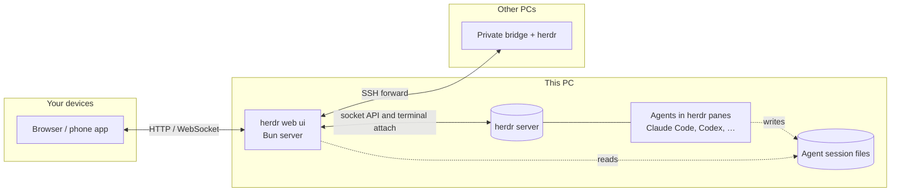

# User guide

[← README](../README.md) · [Quick start](#quick-start) · [Supported agents](#supported-agents) · [Features](#features) · [Phone](#on-your-phone) · [Remote PCs](#remote-pcs-over-ssh) · [Access and safety](#access-and-safety) · [Configuration](#configuration) · [Updates](#updates) · [Keyboard shortcuts](#keyboard-shortcuts) · [How it works](#how-it-works) · [FAQ](#faq)

Install, connect and use herdr web ui on your desktop and phone.

## A look around

<table>
  <tr>
    <td colspan="2"></td>
  </tr>
  <tr>
    <td colspan="2" align="center"><b>Chat</b>: the agent's own transcript, each turn's work folded into one line you can open</td>
  </tr>
  <tr>
    <td width="50%"></td>
    <td width="50%"></td>
  </tr>
  <tr>
    <td align="center"><b>Answer prompts</b>: approvals and questions become cards, answered from the chat</td>
    <td align="center"><b>Terminal</b>: the same pane, live, through<br><code>herdr terminal attach</code></td>
  </tr>
</table>

<p align="center">
  
  
  
  
</p>

<details>
<summary><b>▶ Watch the demos in HD</b> (desktop 1920×1200, phone 1080×1920)</summary>

https://github.com/user-attachments/assets/4ca73671-ebfc-4c18-b8f2-99331abf9fa7

https://github.com/user-attachments/assets/2f030569-1004-425e-835d-9e775ec6e4c8

</details>

## Quick start

> **Want a look first?** [Try it in your browser](https://devswha.github.io/herdr-web-ui/demo/): the app on a fictional session, nothing to install. Nothing in it is live.

> **Setting it up with a coding agent?** Point it at [INSTALL.md](../INSTALL.md), a step-by-step guide written for agents.

**1. Install it** with one line, on Linux (x64, arm64) or macOS:

```bash
curl -fsSL https://devswha.github.io/herdr-web-ui/install.sh | sh
```

It does, in order, only what is not done yet:

- **What it runs on.** [herdr](https://github.com/herdrdev/herdr) 0.9.0+, [Bun](https://bun.sh) 1.4+ and Node 18+ (Node runs the terminal sidecar). A missing one is installed for your user only, without sudo: herdr and Bun by their own installers, into `~/.local/bin` and `~/.bun`, and Node 22 from nodejs.org, checked against its published SHA-256, into `~/.local/share/herdr-web-ui/node`. Nothing is compiled.
- **The app**, as a herdr plugin at the latest release (set `HERDR_WEB_UI_REF` to install another branch or tag): herdr builds it and starts it along with itself, on `127.0.0.1:7317`, following the socket of the current herdr session. When herdr is already running, the app starts now.
- **The phone address.** When Tailscale runs on this PC, it serves the app to your tailnet (`tailscale serve`, see [On your phone](#on-your-phone)), tells you the command that undoes it, and prints the address as a QR code. Without Tailscale, it says what to set up.

Run it again at any time, for example after setting up Tailscale: it keeps what is there and prints the address and QR code again.

<p align="center">
  
</p>

<sub>A PC named fresh-pc on a sample tailnet (alice@example.com): the names and the QR code are placeholders.</sub>

<details>
<summary>Other ways to install</summary>

**The plugin alone**, when herdr, Bun and Node are there already. After installing, choose
the plugin's **Phone setup** action inside herdr to see the address, QR and a pairing code.

```bash
herdr plugin install devswha/herdr-web-ui
```

**From a checkout:**

```bash
git clone https://github.com/devswha/herdr-web-ui.git
cd herdr-web-ui
bun install
bun run start
```

`start` builds the client and runs the server under the update supervisor. It talks to `~/.config/herdr/herdr.sock` unless `HERDR_SOCKET` says otherwise.

</details>

**2. Open it** at **http://localhost:7317**. Every workspace of your herdr session is a row in the sidebar, as in herdr's own; a workspace with several tabs or panes shows them in a strip over the pane. Pick one, start a new agent with **New workspace**, or add a tab to a workspace with **New tab** (the row's **⋯** menu, the header button, or the strip's `+`). A tab is renamed with a double-click on its name and closed with its **x** (or a right-click for both); on a phone the open tab's chevron opens the same menu.

**3. Take it with you.** Scan the installer's QR code with a phone signed in to the same Tailscale account, then install the app from the browser. See [On your phone](#on-your-phone).

### In a terminal

**The phone address, again:** run the one-line installer again. On a PC where the app is installed it installs nothing and prints the address and its QR code, serving the app to your tailnet first if nothing does yet. It finds the version that actually runs: herdr's plugin directory keeps the version first installed, and **Settings → Updates** runs newer ones from `~/.config/herdr-web-ui/updates`. From a checkout, `bun scripts/plugin.ts phone` does the same.

**A pairing code, on a PC with no browser of its own:**

```bash
bun "$(ls -d ~/.config/herdr/plugins/github/devswha.herdr-web-ui-* | head -1)/scripts/plugin.ts" pair   # plugin install
bun scripts/plugin.ts pair                                                                             # from a checkout
```

`pair` prints the code, the address the phone opens when Tailscale serves one, and that address as a QR code. Neither is a herdr action: herdr keeps an action's output in its log, and a pairing code belongs on the screen. The actions start, stop and report on the server:

```bash
herdr plugin action invoke devswha.herdr-web-ui.start    # leaves a running server alone
herdr plugin action invoke devswha.herdr-web-ui.status
herdr plugin action invoke devswha.herdr-web-ui.phone    # visible phone setup pane
herdr plugin action invoke devswha.herdr-web-ui.stop
```

Its PID and log live under `HERDR_PLUGIN_STATE_DIR`. For persistent settings (see [Configuration](#configuration)), add `KEY=value` lines to the `env` file (no dot) in the directory that `herdr plugin config-dir devswha.herdr-web-ui` prints. A plugin checkout from 0.3.25 on also reads `.env` there, which wins where both set a key; an older one needs a plugin reinstall first, since in-app updates do not replace the checkout. The plugin's `status` prints the files it read. Protect that file if it holds a token.

### Uninstall

```bash
herdr plugin action invoke devswha.herdr-web-ui.stop
herdr plugin uninstall devswha.herdr-web-ui
tailscale serve --https=<port> off    # the port the installer printed, if it served the app
```

The installer's herdr, Bun and Node stay, since other tools may use them: `~/.local/bin/herdr`, `~/.bun`, and `~/.local/share/herdr-web-ui/node` with its link `~/.local/bin/node`. Push keys and paired devices are in `~/.config/herdr-web-ui`.

## Supported agents

Every agent herdr runs shows up with its live status, terminal and alerts. The chat view reads the agent's own session files wherever it knows where they are:

| Agent | Chat | Answer prompts from chat |
| --- | --- | --- |
| **Claude Code** | Native transcript, resolved through herdr | ✓ approvals, questions, plan and menu picks, and the `/model` list (picked for the session) |
| **Codex** | Native rollout, with tool results and commentary/final phases | ✓ approvals and questions, including queued ones, and the `/model` lists (picked for the session) |
| **omp** | Native session file | ✓ |
| **omo** | Native session file, found through the pane's process tree | — use Terminal |
| **gjc** | Native session file, from the session directory gjc keeps open | — use Terminal |
| **pi** | Native session file, resolved through herdr; after `/tree`, the branch in play | ✓ its dialogs: a question, a confirmation, an answer typed in |
| **Anything else** | The terminal's text | — use Terminal |

When the last visible line is a familiar password, SSH passphrase or PIN request, both
views show a **Password or PIN** field. It hides what you type and sends it directly
to the terminal with Enter. The value is cleared on send, cancel, disconnect, pane
change or when the page goes into the background. It never enters the message queue,
draft storage or chat history. A changed prompt or busy pane refuses the send; check
the terminal before entering it again. **Cancel** sends Ctrl+C. Remote PCs need bridge
bundle v6. Detection covers a narrow list of English prompts, not every program or language.

A ring by the message box shows how much of the model's context the last request filled, and
its exact token counts on a tap. A pi pane shows it once `~/.pi/agent/models.json` states that
model's window, which is the file pi reads its own providers from; a model it states no window
for shows no ring rather than a guessed one, because pi answers those from a catalogue or a
running llama.cpp server that this app cannot ask. The model and reasoning effort come from what the session recorded, never from answer text. A todo list shows where the agent recorded it, in the turn's work block: Claude Code's `TodoWrite`, Codex's `update_plan`, or omp, omo and gjc todo calls. Plain-text plans and Claude Code `TaskCreate` / `TaskUpdate` calls are not currently reconstructed. Details and verification are in the [chat-mode audit](chat-mode-audit.md).

## Features

| | |
| --- | --- |
| **Read the conversation** | Prompts and Markdown answers (links, code blocks, tables). Each turn's commands, edits and progress are folded into one "Worked for …" block. Copy an answer as Markdown or plain text. In a pi pane, a picture the agent's own tool opened shows inside that tool's row. |
| **Follow the plan** | A supported todo-tool call folds into the turn's work block like any tool: it reads as the done count or the step it took, and opened, as the whole list by phase. |
| **Drop into the real terminal** | xterm.js on the live pane: full-screen TUIs, raw keys and herdr's scrollback, shared with your own herdr TUI. Drag to select and it is copied on release; the wheel or the screen's edge scrolls further back while you drag. Ctrl+C copies a selection instead of interrupting. |
| **Answer prompts** | Approval, question and plan menus become cards. Tap an option, or type its number in the composer. The server checks that the menu is still current before answering. |
| **Compose** | `/` commands and `@` file mentions, any file or image up to 8 MB attached by path, a draft per pane, and multiple queued messages while the agent works. |
| **Follow every agent** | Live RUN / INPUT / DONE / READY status for all panes, and alerts when an agent needs input, finishes or its terminal ends. |
| **Open what agents make** | A file path in an answer opens in a viewer (images, video, audio, PDF, text), or find it with **Browse files**, and download it to your phone. |
| **Manage sessions** | Start an agent in a folder you type or pick with **Browse**. In New workspace, Browse filters the currently loaded folders as you type (case-insensitive); open a result, then choose **Use this folder**. It does not search subfolders or folders beyond the displayed 500. Add a tab to a workspace (as herdr's prefix+c), switch tabs from the strip over the pane, rename workspaces and panes, reorder workspaces, and jump anywhere from the command palette. |
| **Speak instead of typing** | A mic beside Attach in the composer and beside Send in the terminal input line. Hold to talk or tap twice; the words land at the caret and are never sent by themselves. See [Voice input](#voice-input). |
| **Watch your plan limits** | Beside Settings, how much of each AI subscription signed in on the PC is used, or what is left: the week's or the session's limit per account, and every limit with its reset time on a tap. See [Subscription usage](#subscription-usage). |
| **Make it yours** | English, Korean, Japanese or Simplified Chinese, following the browser or chosen in Settings. Dark, light or system theme, compact density, terminal and chat font sizes, a resizable composer, Enter behavior and thinking visibility. |

## Subscription usage

The strip beside **Settings** shows the plan limits of the AI tools signed in on the PC the app's server runs on: for each account its provider's logo and one limit, the plan's week or its 5-hour session as chosen in Settings (red from 80%). A plan with neither shows its limit closest to running out. Tap it for every limit (5-hour session, week, month, per model where a plan has them) and when each starts over. It is off until you turn it on in **Settings → Subscription usage**: turning it on sends the sign-ins on the server's PC to each provider's usage endpoint.

| Provider | Sign-in it reads |
| --- | --- |
| Claude | Claude Code: the macOS keychain item `Claude Code-credentials`, else `~/.claude/.credentials.json`; the same for each config directory in `CLAUDE_CONFIG_DIR` or `~/.claude-*`. The email from its `.claude.json` |
| Codex | `auth.json` in `CODEX_HOME`, `~/.config/codex`, `~/.codex` and each `~/.codex-*`, else the macOS keychain item `Codex Auth`. The email in its token |
| Cursor | The Cursor app's `state.vscdb` and the `cursor-agent` CLI's macOS keychain item, once when both are one account. Its monthly share, and within it Cursor's own models and the rest |
| Copilot | `~/.config/github-copilot/apps.json` or `hosts.json`, then every account the GitHub CLI holds (`gh auth status`): per GitHub login, the first token that finds a plan |
| Grok | Every account in `~/.grok/auth.json` |
| Antigravity | The macOS keychain item Antigravity signs in with (Gemini and other-model quota) |
| OpenCode | OpenCode Go: the `opencode-go` key, else the `opencode` key, in `~/.local/share/opencode/auth.json` (`opencode/auth.json` under `XDG_DATA_HOME` when it is set), else `OPENCODE_API_KEY`. Its rolling, weekly and monthly limits; a key without a Go subscription is left out |

Only providers with a sign-in are shown; a GitHub account without Copilot is left out. One PC signed in to two accounts of a provider shows both, each named by its email (a login for Copilot) and told apart by its account id, so the same account found in two places counts once. A credential file, a command's output or a provider's answer over 1 MiB is treated as unreadable. Where each sign-in lives and which endpoint states its limits follows [OpenUsage](https://github.com/robinebers/openusage).

- **Read only.** The server never refreshes a token: Claude, Codex, Cursor and Grok rotate refresh tokens, and a refresh the tool did not make would sign it out. An expired sign-in says so; using the tool once renews it.
- **Asked only while someone looks.** Nothing runs in the background. The server asks a provider at most every five minutes, a refresh from the popover at most every 30 seconds, and a provider that answered 429 not before it said to.
- **Yours to arrange.** Settings → Subscription usage orders the accounts, picks the limit the strip shows (**Weekly** or **Session**), hides any (from the strip and its popover alike), and switches the meters between what is used and what is left.
- **The server's PC only.** Remote PCs are not included.
- On macOS, a server started outside the logged-in desktop session (over SSH, or by a multiplexer started there) reads the keychain item through a one-shot job in that desktop session. A keychain that still cannot be opened shows as such instead of the numbers.

## Voice input

Turn it on in **Settings → Voice input**, then hold the mic beside Attach (chat) or Send (the terminal input line) and speak, or tap it once to start and again to finish. A pill above the box shows that it is recording, with the level of your voice and a timer; Esc or ✕ cancels. On a desktop, hold Ctrl+Shift+Space (Cmd+Shift+Space on a Mac). The text goes in at the caret and is never sent by itself, so you can read it first.

- **With an OpenAI API key** (recommended for Korean, Japanese and Chinese mixed with code terms): paste it under **OpenAI API key** in the same section, or set `HERDR_WEB_OPENAI_API_KEY` for the server. The server sends each recording to `gpt-transcribe` with the app's language and English, and the pane's slash commands as hints. In chat, a second call tidies the text (fillers, spacing) and leaves code, paths and flags as you said them; the terminal keeps the words as transcribed unless you turn tidying on there.
- **Without a key**, the browser recognizes the speech itself. Chrome and Edge send the audio to Google or Microsoft for that; Safari uses Apple's.
- **The key stays on the server.** It is kept in `voice.json` under `HERDR_WEB_STATE_DIR` (readable by your user only) and never sent to a browser. Every device that can type into your terminals (your own Tailscale login, a paired device, the token) dictates with it, and the use is billed to that key. A device paired to watch only can neither dictate nor change the key.
- **Silence is not sent.** The recorder runs only while it hears speech, so the pauses before, between and after your words are neither uploaded nor billed. A recording with no speech is not sent at all.
- Recording needs HTTPS (or `localhost`): the mic is turned off on a plain `http://` LAN address. To use another OpenAI-compatible server, set `HERDR_WEB_OPENAI_BASE_URL`; a key from `HERDR_WEB_OPENAI_API_KEY` is only ever sent there or to OpenAI.

## On your phone

Serve the app over **HTTPS** to install it and receive push alerts. The simplest way is Tailscale: keep the server on `127.0.0.1` and let Tailscale add the HTTPS address.

```bash
tailscale serve --bg --https=443 http://127.0.0.1:7317
```

The one-line installer runs this for you when Tailscale runs on the PC and does not serve the app yet, on the first free port of 443, 8443, 7317 and 17317, and prints the command that undoes it. On Linux, `tailscale serve` needs root or `sudo tailscale set --operator=$USER` once; the installer says so when Tailscale refuses.

Only devices in your tailnet can open that address, and only yours get in without a code: see [Access and safety](#access-and-safety).

**Settings → Phone** in the app does this step for you as far as it can: it shows the address Tailscale already serves for this PC as a QR code, or the exact command still to run, and the address it will give.

1. Open the address.
2. Install the app: in Safari, choose **Share → Add to Home Screen**; in Chrome, choose **Install app**.
3. Open the **⋯** menu at the top right and tap **Alerts** to turn on alerts for that device. iPhone needs iOS 16.4+ and the home-screen app.

To check alerts later, choose **Settings → Alerts → Send test**. The result tells you
whether the test was sent or failed; a missing subscription offers **Turn alerts on again**.

On a phone:
- Agent panes open in the chat.
- The terminal gets a key bar above the keyboard (Esc, Tab, Ctrl, Alt, arrows, Ctrl+C).
  **Settings → Appearance → Key bar** adds or removes Alt, Shift+Tab, Home/End, PgUp/PgDn,
  Ctrl+D, Ctrl+Z, `|`, `~` and `/`.
- Dragging the terminal scrolls the real herdr pane.
- **Settings → Phone → Keep screen on** keeps the screen awake while a terminal or chat
  pane is open. It is off by default, releases when the app is hidden, and resumes when
  you return. It needs HTTPS or localhost and browser support; power-saving mode may refuse it.

A plain HTTP LAN address also works in the browser, but it can't install the app or receive push.

The running server sends the alerts. Keep it running, and keep `HERDR_WEB_STATE_DIR` across restarts, since it holds the push key and device subscriptions.

## Remote PCs over SSH

A workspace row's **⋯** menu offers **New worktree** and **Open worktree…**, as herdr's own worktree keys do: the first checks a branch out as a git worktree under herdr's worktree folder and opens it as a workspace next to the repository's, the second lists the repository's other checkouts and opens one. New worktree opens with a branch (`worktree/brave-valley-07f8` style) and a name already filled in, as herdr's own form does; type over either. **Agent** picks what starts in the new checkout, as New workspace does: the agent you last started, or Shell for none. In the By workspace view a worktree workspace sits under its repository's row. Its menu ends in **Delete worktree checkout…**, which deletes the folder and closes the workspace but keeps the branch; a checkout with unsaved changes is refused first, in git's words, with **Delete anyway** as the second step. Closing the repository's workspace closes its open worktree workspaces with it and leaves their checkouts on disk.

Open Settings → Remote PCs and choose **Add PC** (the command palette has it too), then enter an SSH alias or `user@host` for a Linux or macOS computer. The setup dialog walks you through the host fingerprint, the password or key passphrase, and an explicit install approval. The PC's workspaces then join the sidebar, and chat, files, terminal input and alerts all follow the PC you pick.

- **SSH runs on the server**, as the web server's account, with its OpenSSH configuration and agent. The browser never opens SSH itself.
- **The remote side gets a private runtime bundle** and a loopback-only bridge, reached through an SSH forward.
- **A herdr already running there** is never stopped or replaced.
- **Bridge updates:** when an app update needs a newer bridge, PCs that connect with their saved key are updated in the background.

More in [remote PCs](remote-pcs.md).

## Access and safety

Anyone who can reach the server can type into your terminals, so what matters is who gets in. It listens on `127.0.0.1` by default, which means only this computer. From anywhere else, a request gets in in one of three ways:

- **It is you, says Tailscale.** `tailscale serve` states the requesting device's Tailscale login in a header it strips from anything incoming. A login that matches this PC's own gets in; another login is refused, and a tagged device (one with no person's login) needs pairing. Nothing to set up, unless this PC's own Tailscale node is tagged: it then has no login of its own, so every device pairs, yours included, or you name your login in `HERDR_WEB_TAILSCALE_OWNER`.
- **It is a paired device.** **Settings → Devices**, on the PC (or on a device already paired), shows a six-digit code that lives ten minutes and a QR code that carries it. On a headless PC, the `pair` command prints the same in its terminal (see [In a terminal](#in-a-terminal)); Devices also shows the pairing link as text, to send to the other device. The other device enters it once and keeps its own credential in an HttpOnly cookie; the list shows it, and **Revoke** immediately closes its terminal connections and roster stream and refuses subsequent requests.
- **It holds the token.** `HERDR_WEB_TOKEN`, for scripts and proxies, as a cookie after sign-in or as `Authorization: Bearer <token>`. When a token is set, everything else needs it, this computer and your own Tailscale login included: enter it once on each device, and that browser stays signed in for a year. A paired device still gets in without it.

| How you reach it | What gets you in |
| --- | --- |
| This computer only (default) | Nothing needed. With a token set, the token |
| SSH tunnel (`ssh -L 7317:127.0.0.1:7317 host`) | Nothing needed. With a token set, the token |
| `tailscale serve`, your own devices | Nothing needed: your login. With a token set, the token, once per device |
| `tailscale serve` on a tailnet you share with others | Your devices: your login (with a token set, the token once). Theirs: refused unless you pair them |
| Your LAN (`HOST=0.0.0.0` or a LAN address) | Pair each device, or set a token |
| A public domain or reverse proxy | Set a token, with HTTPS, and set the proxy up as in [Behind a reverse proxy](#behind-a-reverse-proxy). Never `tailscale funnel` it |

Until the first device is paired, and with no token set, a LAN or proxied address is open to anyone who reaches it, as it always was: the server warns on startup. The exception is a proxy on this PC while its Tailscale login is known, as with `tailscale serve`: a request that carries no login there needs pairing from the start. Pairing the first device closes it for good; revoking every device does not reopen it. Without a token, this computer itself stays in whatever happens, so you can never lock yourself out: revoke everything and pair again from `http://localhost:7317`. With a token set, this computer signs in with the token.

The pairing code is a one-time secret: five wrong tries spend it.

### Behind a reverse proxy

**Set a token first** (`HERDR_WEB_TOKEN`). A proxy on this PC connects from this PC, so the server knows a proxied request only by what the proxy sends: an `X-Forwarded-For` header (or another forwarding header), or a `Host` that is not `localhost` or `127.0.0.1`. A proxy that sends neither makes every visitor count as this computer: they get in with nothing, and pairing a device does not close it. nginx's plain `proxy_pass` is such a proxy. With a token set, every visitor needs the token whatever the proxy sends.

The proxy has to do four things:

- keep the browser's `Host`, so the app's own requests are not refused as coming from another site (`invalid_origin`);
- send `X-Forwarded-For`, so a visitor is not taken for this computer;
- send `X-Forwarded-Proto: https` when it serves HTTPS, so cookies are marked Secure and the app's own requests are accepted;
- pass the WebSocket upgrade for `/ws`, which carries the terminal.

Caddy does all four by default, and gets the certificate itself:

```caddyfile
herdr.example.com {
	reverse_proxy 127.0.0.1:7317 {
		header_up -Tailscale-User-Login
	}
}
```

nginx does none of them by default:

```nginx
map $http_upgrade $connection_upgrade {
    default upgrade;
    ''      close;
}

server {
    listen 443 ssl;
    server_name herdr.example.com;
    ssl_certificate     /etc/letsencrypt/live/herdr.example.com/fullchain.pem;
    ssl_certificate_key /etc/letsencrypt/live/herdr.example.com/privkey.pem;

    location / {
        proxy_pass http://127.0.0.1:7317;
        proxy_http_version 1.1;
        proxy_set_header Host $http_host;
        proxy_set_header X-Forwarded-For $proxy_add_x_forwarded_for;
        proxy_set_header X-Forwarded-Proto $scheme;
        proxy_set_header Tailscale-User-Login "";
        proxy_set_header Upgrade $http_upgrade;
        proxy_set_header Connection $connection_upgrade;
        proxy_read_timeout 1h;
        proxy_buffering off;
    }
}
```

The `map` block goes in the `http` section. `proxy_read_timeout` keeps an idle terminal connected, and `proxy_buffering off` lets the PC list update live.

Both examples drop a `Tailscale-User-Login` header a visitor sends. That header is how `tailscale serve` names your own login, and on a PC that runs Tailscale the server trusts it from any proxy on this PC, so a public proxy must not pass a visitor's copy on. With a token set the server asks for the token whatever that header says, so a proxy that does pass it on gives a visitor nothing.

To check it, open `https://herdr.example.com/api/session` from another device without signing in: it must answer 401.

**Sign out** in the header or command palette clears this browser's token and device cookies; terminal sessions and agents keep running. It is shown for token or device authentication, not automatic local or Tailscale access.

If `devices.json` under `HERDR_WEB_STATE_DIR` (default `~/.config/herdr-web-ui`) is corrupt or unreadable, the server keeps unrecognized external clients out and preserves the file. Local access and the owner's trusted Tailscale login without a configured token, and a valid token, still work. Settings → Devices and the server log explain the error. Restore a valid registry from backup or fix its permissions, then restart; pairing and device changes remain disabled until it is repaired.

Nothing is typed without you:
- Input typed while disconnected waits as a draft for you to send or discard.
- Queued messages stay with their PC and pane across reloads. Edit, discard, or explicitly send each item; status changes and reconnects never send them automatically.
- An answer typed to a prompt waits for **Confirm**.

Attaches and reconnects wait when another client holds the terminal. **Open here** on the waiting
notice explicitly takes that pane with `--takeover`: the other web bridge waits in turn, while a
standalone `herdr terminal attach` exits. The herdr TUI stays connected (verified on herdr 0.9.3).
Observe connections cannot take a pane, and a displaced bridge never takes it back automatically.

## Configuration

| Variable | Default | Purpose |
| --- | --- | --- |
| `HOST` | `127.0.0.1` | Bind address. Use `0.0.0.0` or a LAN address only with `HERDR_WEB_TOKEN` set or once a device is paired: until then that address is open to anyone who reaches it (see [Access and safety](#access-and-safety)). |
| `PORT` | `7317` | HTTP and WebSocket port. Left unset, the plugin takes the next of 17317, 27317, 37317 and 47317 when 7317 cannot be opened (another program has it, or Windows reserves it for Hyper-V, WSL2 or Docker), keeps that port for later starts, and the installer and the **herdr web ui status** action print the address. A port set here is never changed |
| `HERDR_SOCKET` | `~/.config/herdr/herdr.sock` | herdr socket for API calls and terminal attach. For a named session, use `~/.config/herdr/sessions/<name>/herdr.sock`. |
| `HERDR_WEB_TOKEN` | unset | Shared token for scripts and proxies. Once set, every client that is not a paired device needs it, this computer and your own Tailscale login included |
| `HERDR_WEB_TAILSCALE_OWNER` | this PC's Tailscale login | The Tailscale login that gets in through `tailscale serve` without pairing. Set it on a PC whose Tailscale node is tagged, which has no login of its own |
| `HERDR_WEB_STATE_DIR` | `~/.config/herdr-web-ui` | Push keys, device subscriptions, PC registrations and update builds |
| `HERDR_WEB_OPENAI_API_KEY` | unset | OpenAI API key for [voice input](#voice-input). Set here, it cannot be changed from the app |
| `HERDR_WEB_OPENAI_BASE_URL` | `https://api.openai.com/v1` | OpenAI-compatible API root for voice input |
| `HERDR_WEB_AUTO_UPDATE` | `0` | `1` installs new releases without asking |
| `HERDR_WEB_PUSH_SUBJECT` | this repository's URL | VAPID contact URL or `mailto:` address |
| `HERDR_WEB_BUNDLE_MANIFEST` | unset | Remote-PC bundle manifest (path or URL) that overrides local and published bundles |
| `HERDR_WEB_HERDR_BIN` | `herdr` | herdr executable used for terminal attach |
| `HERDR_WEB_PASTE_DIR` | `<pane cwd>/.herdr-web-ui` | Where pasted and attached files are saved: an absolute path or `~/…`. Set it to keep them out of your projects; an agent may then ask before reading one. It covers the panes of this server's PC; a remote PC keeps the default |
| `CODEX_HOME` | `~/.codex` | Where Codex sessions are read |

## Updates

`bun run start` and the plugin look for a newer **release** 10 seconds after start and then every 5 minutes. A release is a `vX.Y.Z` tag ([changelog](../CHANGELOG.md)); commits between releases never reach installs. When a new version is out, a line under the header names it, and its **Update** button installs it and shows the install's steps; **Settings → Updates** has the same controls and the full error when an install fails. To install releases without asking, set `HERDR_WEB_AUTO_UPDATE=1`.

An update is built and typechecked in a private checkout while the current server keeps serving. The new server must pass a health check, or the previous build comes back. herdr and your agents keep running, and a **Reload app** notice lets you save drafts before the new frontend loads.

Updates need a clean checkout: `main` for a source install, or herdr's plugin checkout. Local changes block an update, and they are never overwritten. More in [app updates](app-updates.md).

### Updating herdr

herdr itself is updated from **Settings → herdr → Update herdr**. herdr refuses `herdr update` typed into one of its panes ("run `herdr update` outside herdr"), and every terminal in the app is a pane, so the server runs it instead, for the herdr on the PC the app runs on:

- It installs the newest herdr and moves the running panes onto it with a live handoff. Panes and agents keep running, and open terminals reconnect.
- If a newer herdr was already installed from a shell, the running server is still the old one: Settings says so, and the button only moves the panes.
- What herdr printed is shown under the button. A herdr installed with Homebrew, mise or Nix is updated with that tool, and herdr's message names the command.

This is for Linux and macOS. On Windows, and for a remote PC, update herdr on that PC.

## Keyboard shortcuts

`Mod` is **⌘** on macOS and **Ctrl** elsewhere. Every shortcut adds Shift, so the terminal keeps its own Ctrl keys.

| Shortcut | Action |
| --- | --- |
| `Mod+Shift+K` | Command palette |
| `Mod+Shift+J` | Switch Chat / Terminal |
| `Mod+Shift+B` | Toggle sidebar |
| `Mod+Shift+O` | New workspace (`Mod+Shift+N` too, in the installed app: a Chrome tab keeps `Ctrl+Shift+N` for an incognito window) |
| `Mod+Shift+↑` / `↓` | Previous / next pane |
| `Mod+Shift+,` | Settings |

Enter sends and Shift+Enter adds a line. Settings can switch sending to Mod+Enter.

## How it works



A React client talks to a Bun HTTP/WebSocket server.

- **Status:** the server reads workspaces and agent status from herdr's Unix socket.
- **Terminal:** it streams the real `herdr terminal attach` output through a Node PTY sidecar. Browsers watching one pane share one attach, with a bounded replay and backpressure ([terminal flow control](terminal-flow-control.md)).
- **Chat:** it reads the agents' own session files, and sending types into the same live pane.

herdr owns the processes and the scrollback.

## FAQ

<details>
<summary><b>Does it replace herdr's own TUI?</b></summary>

No. Both attach to the same terminals at the same time. Use the TUI at your desk and the web app anywhere else. Nothing needs to be stopped or handed over.
</details>

<details>
<summary><b>Do I need Tailscale?</b></summary>

No, but a phone needs two things Tailscale gives at once: a way to reach the PC from outside your network, and HTTPS, which installing the app and push alerts both require. Without it:

- **An SSH tunnel from the phone** (Termux, Blink): `ssh -L 7317:127.0.0.1:7317 <pc>`, then open `http://localhost:7317` on the phone. Browsers treat localhost as secure, so installing and alerts should work while the tunnel is up (not verified on iOS yet). The phone still has to reach the PC over SSH.
- **A VPN into your home** (WireGuard, ZeroTier, a router VPN): the LAN address works in the browser, but a plain `http://` address can neither install the app nor receive alerts.
- **A reverse proxy with a real certificate** on a domain you own, with a token set and the proxy sending `X-Forwarded-For`: [Behind a reverse proxy](#behind-a-reverse-proxy) has Caddy and nginx examples to copy. This exposes the server to the internet, so read [Access and safety](#access-and-safety) first.
</details>

<details>
<summary><b>Does my code or conversation leave my machine?</b></summary>

Session files stay on the PC running each agent, and their contents are sent to browsers connected to the app. herdr web ui has no hosted relay or account service of its own. The agents' own connections to model providers depend on their configuration.

Optional features can send data off the PC:
- [Voice input](#voice-input) sends recordings to the configured transcription provider; polishing also sends the transcribed text. Without a configured API key, browser speech recognition may use the browser vendor's service.
- [Subscription usage](#subscription-usage), when enabled, sends each provider's credentials to that provider's usage endpoint.
- Updates and remote-PC setup fetch releases or configured runtime bundles over the network; remote panes are reached over SSH.
- Enabled push alerts go through the browser vendor's push service as encrypted notifications.

See [Access and safety](#access-and-safety) for who can connect to the app.
</details>

<details>
<summary><b>An agent is missing from the chat, or shows only terminal text.</b></summary>

The chat needs the agent's own session file. Check that the agent runs in a herdr pane on this PC (or on an added PC) and has already written its first message. Agents without a native reader always get the terminal-text view, and the Terminal view always works.
</details>

<details>
<summary><b>The colors look too dark, or the light theme looks dark, in Samsung Internet.</b></summary>

Samsung Internet has a forced dark mode that repaints every page, including one that brings its own light and dark themes, as this app does. A light theme comes out dark, and a dark one is darkened a second time: similar shades run together, and the bars of the plan meters can look empty. Turn off **Force dark mode for web content** (**웹 콘텐츠에 어두운 화면 모드 강제 적용**) in Samsung Internet's settings, or open the app in Chrome. Reported on a Galaxy Tab S7+ ([#451](https://github.com/devswha/herdr-web-ui/issues/451)).
</details>

<details>
<summary><b>How is this different from collie, roamgate or herdr-remote?</b></summary>

All three are in the herdr plugin marketplace too, and each does something this app does not. [collie](https://github.com/AltanS/collie) is a mobile terminal for herdr, tmux and zellij, with a status dashboard, a key pad, quick replies and voice input, served over Tailscale by its own bridge. [roamgate](https://github.com/powerfooI/roamgate) is a browser client for herdr with a file explorer and diff annotations, installed by its own script. [herdr-remote](https://github.com/dcolinmorgan/herdr-remote) is a macOS menu-bar app with a phone dashboard and a Telegram bot behind a relay and a free tunnel.

herdr web ui reads the agent's own transcript, so Claude Code, Codex, omp, omo, gjc and pi panes are a chat with the work folded per turn, and a prompt card is checked against the live menu before its answer is typed. The terminal is the same live pane as your TUI, other PCs join over SSH from the sidebar, and it installs and updates as a herdr plugin, with no server or account of its own. It brings no tunnel: you reach it over Tailscale, SSH or your own HTTPS proxy. If you want tmux or zellij, diffs, Telegram or a tunnel out of the box, one of the others is the better fit.
</details>

<details>
<summary><b>How is this different from Happy, Paseo or CloudCLI UI?</b></summary>

Those projects start and manage agents through their own wrapper, daemon or server, and bring their own apps. herdr web ui adds nothing between you and the agent. It is a window onto the herdr sessions you already run, so the same pane is live in your terminal, your browser and your phone at once. If you don't use herdr, one of those is the better fit.
</details>
